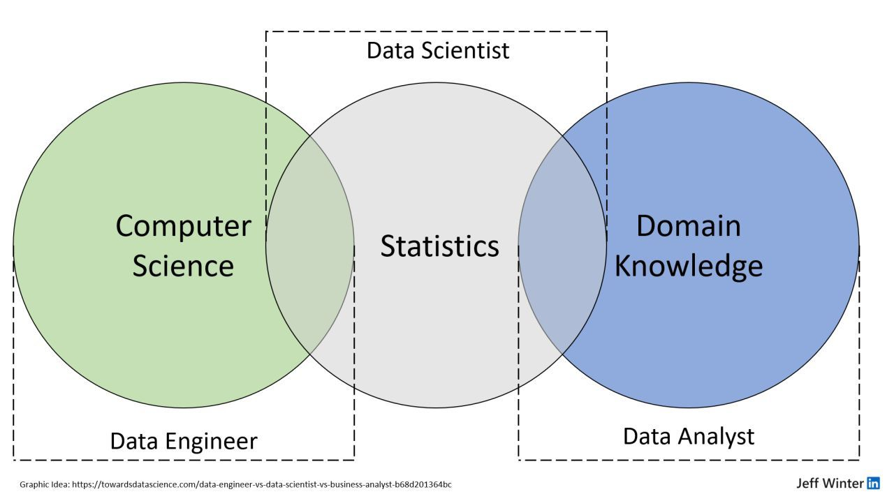

# Bienvenido a las sesiones de Data de Csar

Este repositorio está diseñado como un espacio de aprendizaje y exploración para adentrarse en el fascinante mundo de los **datos**.
Aquí encontrarás ejemplos, guías y ejercicios prácticos que te ayudarán a construir una base sólida y luego avanzar hacia temas más avanzados en **ingeniería y ciencia de datos**.

---

## Descripción

El objetivo de este repositorio es ofrecer una ruta de aprendizaje integral en torno al ecosistema de datos, cubriendo áreas clave como:

- **Procesos ETL (Extract, Transform, Load):** Aprende a mover y transformar datos desde múltiples fuentes.
- **SQL y DuckDB:** Bases sólidas para la manipulación de datos tabulares.
- **Python para Data Science:** Fundamentos y ejemplos prácticos.
- **Librerías de procesamiento:**
  - **Pandas** y **Polars** para análisis de datos.
  - **PySpark** para trabajar con datos distribuidos.
- **Lenguajes complementarios:** Exploración de **Rust** en el contexto de datos.
- **Knowledge Bases y Generative AI:** Introducción a bases de conocimiento y aplicaciones con **IA generativa**.

Este es un espacio en constante evolución, pensado para quienes quieren aprender desde cero o profundizar en áreas específicas de la **ingeniería de datos** y la **inteligencia artificial**.

---

## El espectro de datos en la industria (hasta el 2022)

[Post de la imagen en linkdin por jeff winter](https://www.linkedin.com/posts/jeffreyrwinter_throwbackthursday-data-digitaltransformation-activity-6955875879059128320-vIIz?utm_source=share&utm_medium=member_desktop&rcm=ACoAABv1iqsBenr6COP15aMigU8z6Kf1vMPtjgw)

---

## Cómo empezar

1. Revisa la sección de ejercicios y notebooks disponibles.
2. Sigue el orden sugerido o explora libremente según tu interés.
3. Instala las dependencias necesarias según cada módulo.

---

## Licencia

[Apache 2.0 License](LICENSE)
